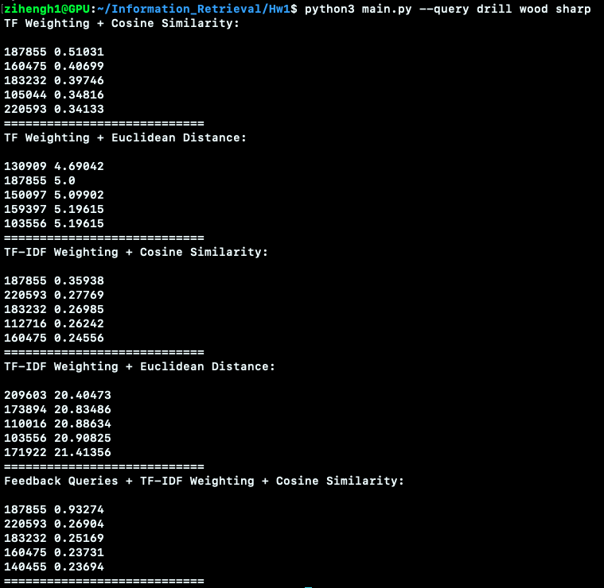

## Project1 105703031 資科四 黃子恒
1. File Tree
    ```
    my project
    │   README.md
    │   main.py
    │   preprocess.py
    │   english.stop
    │   idf_vector.pickle
    │   tfidf_vector.pickle
    │   word_index.pickle
    ```
    File Discription:
    * main.py (To speed up the testing, only have to execute this program. And, it takes about 2 to 3 minutes.)
        ```
        python3 main.py --query drill wood sharp
        ```
    * preprocess.py (Prepare for the word index, tf vector, tf-idf vector, and idf vector.)
    * 
    * idf_vector.picke: every word with its idf value are saved in this file.
    * tfidf_vector.picke: every document with its tf and tf-idf value are saved in this file.
    * word_index.pickle: this file defines the index of every word.
2. Cleaning Part
    * Followed by the template files released by Prof. Tsai, I added one more condition to preprocess the sentence. I remove all the punctuation and number from words. Therefore, the number of word index is down to **17461**.
3. POS Tagger
    * As for the Q5, I used the pos tagger from NLTK library. Only keep the noun and verb in a sentence.
4. Result
    * 
